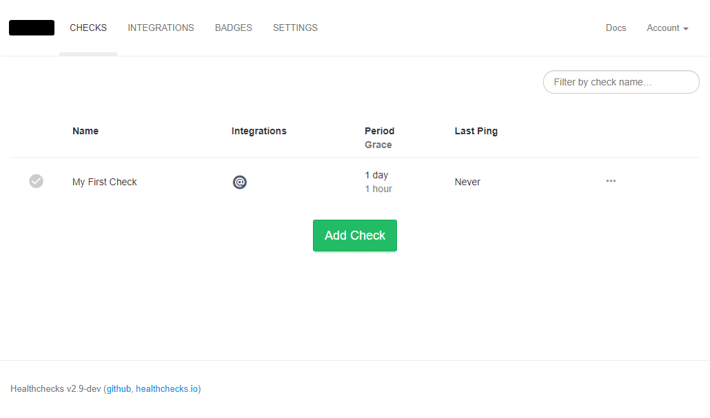

# Install HealthChecks on Debian 12
In this guide I will guide you in the installation of the HealthChecks.io monitoring software in a server with Debian 11 or Debian 12. The [official one](https://healthchecks.io/docs/self_hosted/) is lacking in a lot of areas, so I'm aiming to provide a more complete guide for my use case (HealthChecks + MariaDB).

This guide will install the software directly on the machine. If you want a guide to install and deploy using docker you can check this [official blog post](https://blog.healthchecks.io/2023/05/walk-through-set-up-self-hosted-healthchecks-instance-on-a-vps/).

> Pēteris "cuu508" Caune, the creator of HealthChecks.io, gave me feedback on this guide. If you want to check his comments you can [see them here](https://www.reddit.com/r/selfhosted/comments/13yxtem/comment/jmpu1cs/?utm_source=share&utm_medium=web2x&context=3). I'm really thankful they took the time to read and comment about this, and most of their suggestions are applied in this guide. If there's a suggestion that is not present here, the reason for that is addressed in its section.
{.is-info}

## 1. (Optional) Install a database
If your server is going to handle a lot of monitors with very frequent notifications, you should probably consider using a DBMS like MySQL or PostgreSQL. In this guide I will use MariaDB. You can find a great [installation guide here](https://www.digitalocean.com/community/tutorials/how-to-install-mariadb-on-debian-11).

I'll create a database and an user in the database for HealthChecks with the following commands.
```sql
CREATE DATABASE healthchecks;
GRANT ALL PRIVILEGES ON healthchecks.* TO 'healthchecks'@'localhost' IDENTIFIED BY '---password---';
GRANT ALL PRIVILEGES ON test_healthchecks.* TO 'healthchecks'@'localhost' IDENTIFIED BY '---password---';
FLUSH PRIVILEGES;
```

## 2. Create a system user
To make handling security and permissions easier, we are going to create a system user that will run HealthChecks. I'd choose to call it **healthchecks** and set its home directory in `/opt/healthchecks` (which will be the installation folder). I create it with this command:
```bash
# Create the installation folder. This will also prevent copying 'skel'
mkdir /opt/healthchecks

# Create user as system user with login disabled
adduser --system --group --home /opt/healthchecks --shell /usr/sbin/nologin healthchecks

# Assign limited permissions to the directory
chown root:healthchecks /opt/healthchecks
chmod 0775 /opt/healthchecks
```
If you'd like, you can limit the permissions of this directory even more after doing the steps in this guide, to `0755`, since both HealthChecks and SendAlerts should be able to work without need for write permissions.

## 3. Install dependencies in case you don't have them
Keep in mind that HealthChecks requires Python3.8 or higher. If you are not going to use MySQL/MariaDB you don't need to install `libmysqlclient`.
```bash
apt install gcc git python3-dev python3-venv libcurl4-gnutls-dev librtmp-dev default-libmysqlclient-dev
```

## 4. Create a python virtual environment
Python packages installed globally can interfere with other software (including system applications). For this reason, we will create a Python Virtual Environment where modules will be installed targeting this software only.

As Pēteris Caune mentions, there are cases where it makes sense to install the Python dependencies globally (when dedicating a server or container to HealthChecks, or if you have very limited disk space, to give two examples), but I personally find it hard to recommend it to anyone most of the time. This is why this section is not labeled as optional, but keep in mind you can skip it at your own risk.
```bash
# Go to the installation directory
cd /opt/healthchecks

# Switch to healthchecks user
sudo -u healthchecks bash

# Create the python environment in the directory "venv"
python3 -m venv venv

# Load the venv variables
source venv/bin/activate
```

## 5. Clone repository and install python modules in venv
We still executing this commands from the bash session opened with the user healthchecks, and with the venv variable loaded.
```
git clone https://github.com/healthchecks/healthchecks.git
```
Since we are not using postgresql, we don't need to install the default `psycopg2` dependecy. To archieve this, we should delete the line with said dependency in the file `/opt/healthchecks/healthchecks/requirements.txt`

We can finally install all modules with the following commands. In this installation we are going to implement uWSGI as our Python WSGI, but if you prefer to use other, or you're not using MySQL/MariaDB, you don't need to install `uwsgi` or `mysqlclient` respectively. Lastly, it's **very important that you execute these commands with the venv variables loaded.**
```
pip install wheel mysqlclient uwsgi
pip install -r healthchecks/requirements.txt
```

## 6. Create database tables and HealthChecks' admin account
We need to create the database tables before executing HealthChecks.
### 6.1. (Optional) Setup temporary environment variabels
If you are going to use SQLite you can skip setting these variables.
```bash
export DB=mysql
export DB_NAME=healthchecks
export DB_PASSWORD=insert-your-db-password-here
export DB_USER=healthchecks
```
### 6.2. Create tables and admin account
```bash
cd /opt/healthchecks/healthchecks
./manage.py migrate
./manage.py createsuperuser
```

## 7. Execute tests
To check everything is setup correctly.
```bash
./manage.py test
```

## 8. Define HealthChecks settings
In this guide, we will set the HealthChecks settings with an environment variables file that will be loaded when our service is started.
### 8.1. Create a Django secret key
We need to generate a secret key for django. We can do this by opening a python terminal (by typing the `python3` command), and then executing the following code:
```python
from django.core.management.utils import get_random_secret_key
get_random_secret_key()
```
### 8.2. Create the environment file itself
We save the generated key and write the environment file with the HealthChecks config. I chose to create the file in the path `/opt/healthchecks/.env` with the following data:
```bash
ADMINS=admin@example.com
ALLOWED_HOSTS=healthchecks.example.com,localhost
DB=mysql
DB_NAME=healthchecks
DB_PASSWORD='insert-your-db-password-here'
DB_USER=healthchecks
DEBUG=True
DEFAULT_FROM_EMAIL=noreply@example.com
EMAIL_HOST=smtp.example.com
EMAIL_HOST_PASSWORD='insert the email password here'
EMAIL_HOST_USER=noreply@example.com
EMAIL_PORT=587
EMAIL_USE_TLS=True
EMAIL_USE_VERIFICATION=False
REGISTRATION_OPEN=False
SECRET_KEY='insert the secret key here'
SERVER_EMAIL=noreply@example.com
SHELL_ENABLED=True
SITE_NAME='HealthChecks Server 1'
SITE_ROOT='http://healthchecks.example.com'
```
### 8.3. Restrict access to the environment file
```bash
chmod 0600 /opt/healthchecks/.env
```
We can now exit the bash session open with the healthchecks user.

## 9. (Optional) Create the uWSGI config file
If you've followed this guide, now it's time to setup our Python WSGI. I choose to store it in `/opt/healthchecks/uwsgi.ini` and wrote the following settings:
```ini
[uwsgi]
strict
master
die-on-term
socket = 127.0.0.1:8000
harakiri = 10
post-buffering = 16192
processes = 4
auto-procname
enable-threads
threads = 1
chdir = /opt/healthchecks/healthchecks
module = hc.wsgi:application
thunder-lock
disable-write-exception
plugin = python3
virtualenv = /opt/healthchecks/venv

# workaround for https://github.com/unbit/uwsgi/issues/2299
max-fd = 10000

# compression
check-static = static-collected/
static-gzip-dir = static-collected/CACHE

hook-pre-app = exec:/opt/healthchecks/venv/bin/python ./manage.py migrate
attach-daemon = /opt/healthchecks/venv/bin/python ./manage.py sendalerts
attach-daemon = /opt/healthchecks/venv/bin/python ./manage.py sendreports --loop

if-env = SMTPD_PORT
attach-daemon = /opt/healthchecks/venv/bin/python ./manage.py smtpd --port %(_)
endif =
```
If you aren't going to use a reverse proxy that supports the uWSGI protocol (or no reverse proxy at all), you should replace `socket` by `http-socket`

## 10. Create systemd service
Debian 12 and older uses systemd as init system. We are going to setup a service for HealthChecks to start it on boot. To archieve this, we will create a file with the following content in `/etc/systemd/system/healthchecks.service`
```ini
[Unit]
Description=Healthchecks Server
After=network.target

[Service]
User=healthchecks
Group=healthchecks

NoNewPrivileges=true
PrivateDevices=true
PrivateTmp=true
ProtectHome=true
ProtectSystem=full

EnvironmentFile=/opt/healthchecks/.env
ExecStart=/opt/healthchecks/venv/bin/uwsgi /opt/healthchecks/uwsgi.ini
KillSignal=SIGINT
Restart=on-failure
RestartSec=5s

[Install]
WantedBy=multi-user.target
```

### 10.1. Enable service on startup, and run it.
```bash
systemctl enable healthchecks.service --now
```

## 11. Check everything is ok
We can now browse and use HealthCheck in debug mode. It'll be hosted in the port 8000 of the server we've set up. If you see this, everything has worked correctly!
{.align-center}

## 12. Switch off debug mode
In order to disable debug mode, we need to execute the following commands. I did it with the services turned off.
```bash
/opt/healthchecks/venv/bin/python /opt/healthchecks/healthchecks/manage.py collectstatic
/opt/healthchecks/venv/bin/python /opt/healthchecks/healthchecks/manage.py compress --force
```
And finally we set `DEBUG=False` in out environment file (if you've followed this tutorial it's located in `/opt/healthchecks/.env`)

Finally we turn HealthChecks up again, and check it's working correctly by visitting it.
{.align-center}
Congrats! You now have HealthChecks running in your server!

## 13. Extra: Integration with a Telegram Bot
While HealthChecks already have a built-in integration with Telegram Bots, their integration relies in a WebHook. This requires exposing your HealthCheck Server to the Internet, which I really don't want to do for my use case. Luckily, Telegram Bots can work without need of webhooks, just making an HTTP request to the Telegram Servers specifying the chat and message to send.

> Pēteris Caune points out that the WebHook is only needed for setting up the Telegram integration, after which it won't be necessary. They also mention that an alternative to the way I do it here is using the Apprise integration. I won't be covering neither of these alternatives in this guide.
{.is-info}

### 13.1. Create a Telegram Bot
Create a Telegram Bot, and get its API Key and also your chat ID. There are a lot of guides for this on the Internet.

### 13.2. Create a script for sending the messages
You can find lots of scripts for sending Telegram messages using the Bot API. I like to use this one, from the project [monit2telegram](https://github.com/matriphe/monit2telegram), since I find it very flexible. I'll put this script in `/opt/telegram-bot/send.sh` with execution permissions. I'll paste the script here for completeness:
```bash
#!/bin/bash

function usage
{
    if [ -n "$1" ]; then echo $1; fi
    echo "Usage: sendtelegram [-v] [-c configfile] [-t token] [-i chatid] [-p parse mode] [-m message]"
    exit 1
}

VERBOSE=0

while getopts ":c:t:i:p:m:v" opt; do
    case "$opt" in
        c) CONFIGFILE=$OPTARG ;;
        t) TOKEN_ARG=$OPTARG ;;
        i) CHATID_ARG=$OPTARG ;;
        p) PARSEMODE_ARG=$OPTARG ;;
        m) TEXT=$OPTARG ;;
        v) VERBOSE=1 ;;
        *) echo "Unknown param: $opt"; usage ;;
    esac
done

# Test config file
if [ -n "$CONFIGFILE" -a ! -f "$CONFIGFILE" ]; then echo "Configfile not found: $CONFIGFILE"; usage; fi

# Check config file if given
if [ -n "$CONFIGFILE" ]; then . "$CONFIGFILE";
# Default config file ~/.telegramrc if it exists
elif [ -f /etc/telegramrc ]; then . /etc/telegramrc;
fi

# If TOKEN or CHATID were given in the commandline, then override that in the configfile
if [ -n "$TOKEN_ARG" ]; then TOKEN=$TOKEN_ARG; fi
if [ -n "$CHATID_ARG" ]; then CHATID=$CHATID_ARG; fi

# Verify parameters
if [ -z "$TOKEN" ]; then usage "Bot token not set, it must be provided in the config file, or on the command line."; fi;
if [ -z "$CHATID" ]; then usage "Chat ID not set, it must be provided in the config file, or on the command line."; fi;
if [ -z "$TEXT" ]; then usage "Message not set, it must be provided on the command line."; fi;
if [ ! -z $PARSEMODE_ARG ] && [[ "$PARSEMODE_ARG" != +(markdown|html) ]]; then usage "Parse mode must be either 'markdown' or 'html'."; fi;

# Sending to Telegram
URL="https://api.telegram.org/bot$TOKEN/sendMessage"
TIMEOUT=10

echo "Sending message '$TEXT' to $CHATID"

CMDARGS="chat_id=$CHATID&disable_web_page_preview=1&text=$TEXT"

if [ ! -z $PARSEMODE_ARG ]; then
    CMDARGS=${CMDARGS}"&parse_mode=$PARSEMODE_ARG"
fi

CMD=`curl -s --max-time $TIMEOUT -d "$CMDARGS" $URL 2>&1`

if [ $? -gt 0 ]; then echo "Failed sending Telegram"
else echo "Done!"
fi

if [ "$VERBOSE" -eq 1 ]; then echo $CMD; fi
```
After this, I'll save the API Key and Chat ID in a file in `/opt/telegram-bot/healthchecks/config`
```bash
TOKEN='123456789:aBcDeFgHiJkLmN-OpQrStUvWXyZ12345678'
CHATID='1234567'
```
Next, I'll create a script that simplifies the command and stylizes the message. I will save it in `/opt/telegram-bot/healthchecks/notify.sh`
```bash
#!/bin/bash
EMOJI='❓'
if [ "$2" = 'UP' ]; then
        EMOJI='✅'
elif [ "$2" = "DOWN" ]; then
        EMOJI='⚠️'
fi

/opt/telegram-bot/send.sh \
        -c /opt/telegram-bot/healthchecks/config \
        -p html \
        -m "$EMOJI Service $1 is $2 $EMOJI%0A%0A<b>Server:</b> $(hostname)%0A<b>Time:</b> $3"
```
Finally, I'll set `root` as the owner and `healthchecks` as the group of the directory `/opt/telegram-bot/healthchecks`. I'll give the permissions `0750` to said directory and to the file `notify.sh`. I'll give the permissions `0640` to the file `config`.

### 13.3. Configuring script integration
To integrate the script made with HealthChecks, you need to go to `HealthChecks (web interface) > Integration > Shell command > Add Integration`. The command to execute when the service goes DOWN should be:
```bash
/opt/telegram-bot/healthchecks/notify.sh "$NAME" DOWN "$NOW"
```
And when it goes UP should be:
```bash
/opt/telegram-bot/healthchecks/notify.sh "$NAME" UP "$NOW"
```

## 14. Extra: Reverse proxy with NGINX
We can set a simple reverse proxy with NGINX adding this site config to it:
```nginx
server {
        listen 80;
        listen [::]:80;
        server_name healthchecks.example.com;

        location / {
                uwsgi_pass 127.0.0.1:8000;
                include uwsgi_params;
        }
}
```
